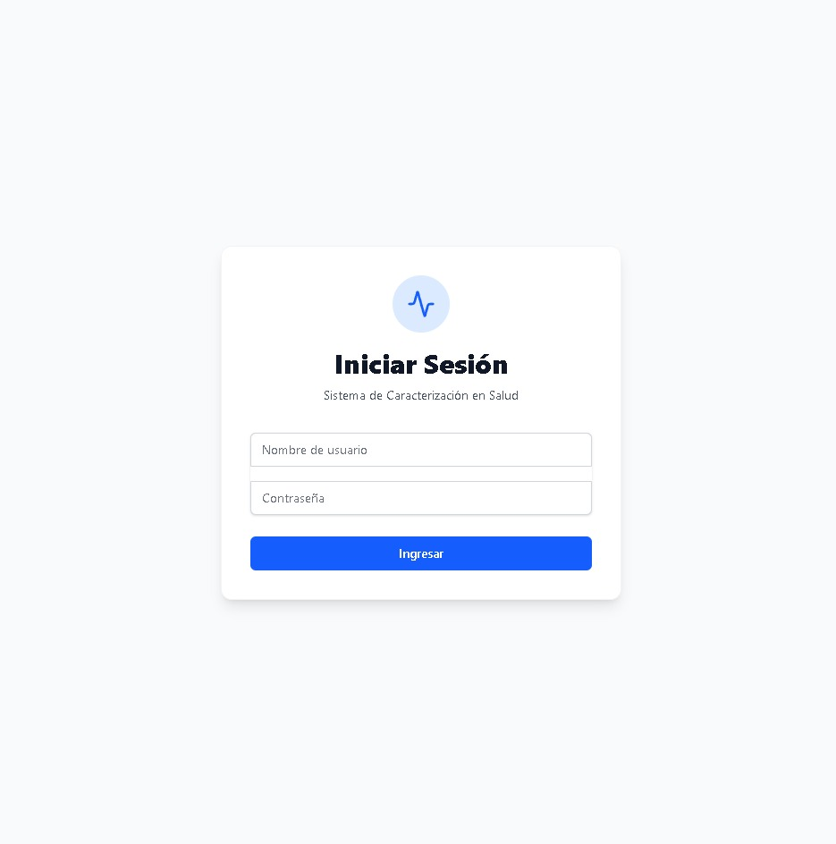
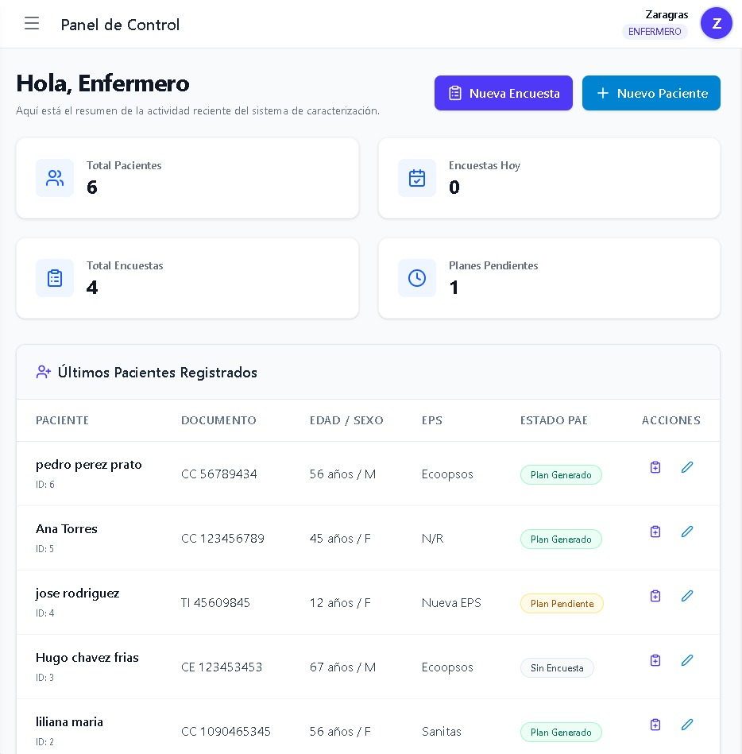
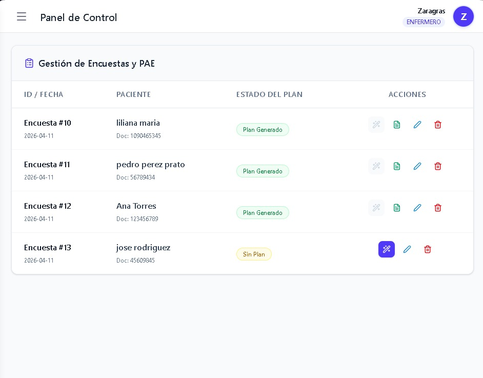
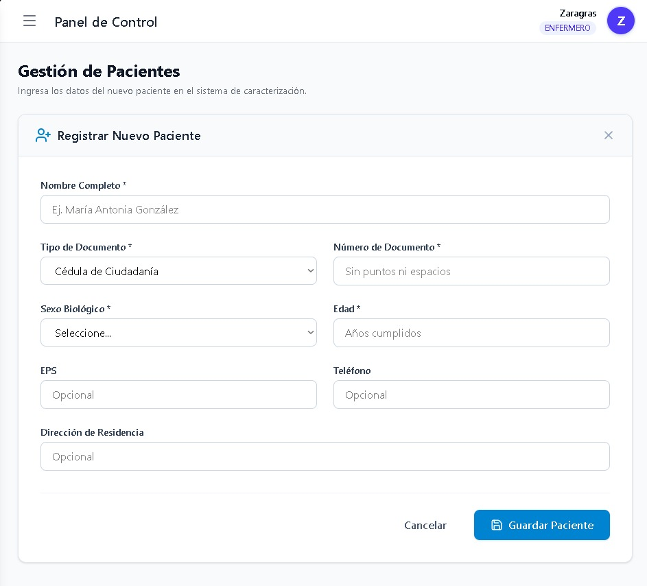
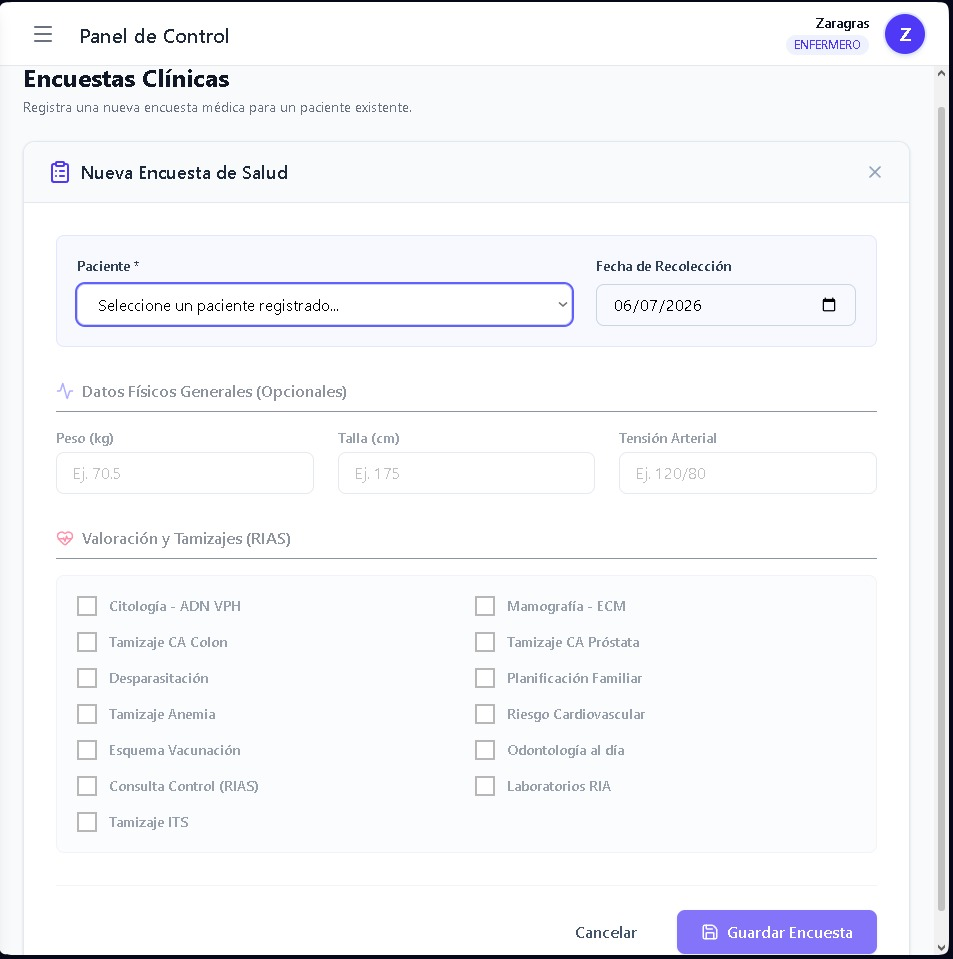
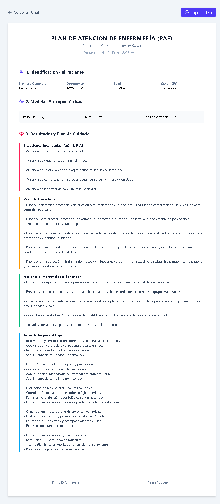

## 🏗️ Arquitectura y Stack Tecnológico
El proyecto está construido bajo una arquitectura cliente-servidor robusta y completamente desacoplada.

### Backend (API RESTful)
* **Framework:** Python con Django y Django Rest Framework (DRF).
* **Base de Datos:** MySQL (conector por defecto de Django `bd_sistema_de_carectizacion_en_salud`) bajo un enfoque relacional.
* **Seguridad:** JSON Web Tokens (JWT) mediante `rest_framework_simplejwt`.

### Frontend (SPA)
* **Core:** React (v19.2) empaquetado con Vite.
* **Estilos y Diseño:** Tailwind CSS (v4) para un diseño utilitario y responsivo.
* **Enrutamiento:** React Router DOM con protección de rutas privadas.
* **Gestión de Estado e Interfaz:** Zustand para el estado global, Lucide React para iconografía consistente, y Axios para peticiones HTTP asíncronas con interceptores.

---
## 📷 Interfaz de la Aplicación (Capturas de Pantalla)

A continuación, se presentan capturas de pantalla de los flujos principales del sistema, utilizando los archivos reales de tu proyecto.

### 1. Control de Acceso (Login)
La primera pantalla que interactúa con el usuario para asegurar el acceso con credenciales válidas y la gestión de roles.


### 2. Panel de Control (Dashboard)
El centro de mando principal, donde el personal de salud visualiza métricas clave y resúmenes de actividad.


### 3. Gestión y Registro de Pacientes
Módulos dedicados para visualizar el padrón completo y agregar nuevos pacientes al sistema de forma estructurada.



### 4. Ciclo Clínico del PAE
Este es el núcleo de la aplicación, dividiendo el flujo en entrada de datos y generación de resultados.

**A. Nueva Encuesta Clínica**
Formulario dinámico y modular para recopilar datos clínicos estructurados y valoraciones del marco RIAS.


**B. Generación e Impresión del Plan de Cuidados**
El resultado final y tangible: la visualización estilizada y lista para imprimir del plan médico completo generado por el MotorPAE.


---

## 💾 Modelos de Datos y Persistencia
La estructura relacional se fundamenta en tres pilares diseñados para escalabilidad y auditoría clínica:

* **Usuarios (`UsuarioCustom`):** Extiende el modelo abstracto de Django. Implementa roles (Administrador / Enfermero) y añade el campo `registro_profesional`, esencial para la trazabilidad de acciones clínicas.
* **Pacientes (`Paciente`):** Entidad troncal. Almacena datos demográficos, de identificación y EPS. Incluye trazabilidad de autoría (`creado_por`) vinculada al usuario operativo para efectos de auditoría.
* **Sistema PAE Avanzado (Encuestas y Planes):**
  * **`Encuesta`:** Vinculada al paciente vía *Foreign Key* (permite múltiples evaluaciones anuales). Registra métricas físicas (peso, talla) y valoraciones booleanas del marco RIAS (Rutas Integrales de Atención en Salud) como citologías, tamizajes y vacunación.
  * **`PlanCuidado`:** Relación *OneToOne* estricta con `Encuesta`. Almacena en campos de texto masivo los resultados lógicos y matemáticos procesados por el motor de reglas (situaciones, prioridades, intervenciones y actividades).

---

## 🔀 Flujo de la Aplicación y Endpoints REST
**Flujo de Seguridad:** El usuario inicia sesión y el frontend almacena los tokens JWT en el estado. Mediante interceptores de Axios, estos se envían de forma transparente en los *headers* de cada petición. A nivel de UI, el componente `<ProtectedRoute />` impide el montaje de vistas privadas sin un token activo y válido.

### Endpoints Principales
* `POST /api/token/` - Generación e intercambio de credenciales por JWT.
* `POST /api/token/refresh/` - Refresco silencioso del token para evitar desconexiones de usuario.
* `GET / POST /api/pacientes/` - (Expuesto vía DefaultRouter) Gestión del padrón de pacientes.
* `GET / POST /api/encuestas/` - Registro de evaluaciones físicas y tamizajes.

Las vistas del frontend (`/dashboard`, `/pacientes/nuevo`, `/encuestas/nueva`, `/planes/documento/:id`) operan consumiendo y actualizando estos recursos asíncronamente vía payloads JSON, sin recarga de página.

---

## 📊 Estado Actual del Proyecto (Roadmap)

### 🟢 Módulos Completados
* Configuración base e integración del stack (Vite + Tailwind CSS).
* Sistema completo de Autenticación JWT, sesión global (Zustand) y ruteo privado.
* Esquema estructural de la base de datos MySQL (Relaciones `OneToOne` y `ForeignKey` documentadas y optimizadas).
* *Dashboard* de instrumentos principal e interfaces dinámicas de captura (Formularios de paciente y encuestas).

### 🟡 En Desarrollo / Fase de Pruebas
* **MotorPAE (Generador Lógico):** Desarrollo del algoritmo central en el backend para procesar reglas RIAS a partir del modelo `Encuesta` y popular automáticamente el `PlanCuidado`.
* **Vista de Documentos A4 (`PlanDocumento`):** Componente indexado diseñado para visualización, impresión y exportación del plan médico final. Actualmente en proceso de estilización CSS *print-friendly* y poblamiento de datos.


```markdown


## ⚙️ Instalación y Configuración Local

Sigue estos pasos para levantar el entorno de desarrollo en tu máquina local. El proyecto está dividido en dos partes principales: el servidor (**Backend**) y la interfaz de usuario (**Frontend**).

### 📋 Prerrequisitos

Asegúrate de tener instalados los siguientes componentes en tu sistema:
* [Python 3.10 o superior](https://www.python.org/)
* [Node.js (v18+) y npm](https://nodejs.org/)
* [MySQL Server](https://dev.mysql.com/downloads/)

### 🗄️ 1. Configuración de la Base de Datos

1. Inicia tu servidor MySQL local.
2. Crea una base de datos vacía para el proyecto. Puedes hacerlo desde tu cliente SQL preferido o usando la terminal:

```sql
CREATE DATABASE bd_sistema_de_carectizacion_en_salud CHARACTER SET utf8mb4 COLLATE utf8mb4_unicode_ci;

```

### 🐍 2. Configuración del Backend (Django)

Abre una terminal y navega hasta la carpeta del proyecto.

1. **Ingresa al directorio del backend:**
```bash
cd backend

```


2. **Crea y activa un entorno virtual:**
```bash
# Creación del entorno
python -m venv venv

# Activación en Windows (PowerShell)
.\venv\Scripts\activate

# Activación en macOS/Linux
source venv/bin/activate

```


3. **Instala las dependencias:**
```bash
pip install -r requirements.txt

```


4. **Configura las variables de entorno:**
Crea un archivo `.env` en la raíz de la carpeta `backend` basándote en un archivo `.env.example` (si existe), o configura directamente los accesos a tu base de datos MySQL en `settings.py`.
5. **Aplica las migraciones a la base de datos:**
```bash
python manage.py migrate

```


6. **Crea un superusuario (Administrador inicial):**
```bash
python manage.py createsuperuser

```


7. **Inicia el servidor de desarrollo:**
```bash
python manage.py runserver

```


*El backend estará corriendo en `http://localhost:8000*`

### ⚛️ 3. Configuración del Frontend (React + Vite)

Abre una nueva pestaña en tu terminal y mantén el backend corriendo.

1. **Navega al directorio del frontend:**
```bash
cd frontend

```


2. **Instala las dependencias de Node:**
```bash
npm install

```


3. **Configura las variables de entorno:**
Crea un archivo `.env` en la raíz de la carpeta `frontend` para apuntar a la API de Django:
```env
VITE_API_URL=http://localhost:8000/api

```


4. **Inicia el servidor de Vite:**
```bash
npm run dev

```


*El frontend estará corriendo y accesible desde el enlace local generado (generalmente `http://localhost:5173`).*

```

```
